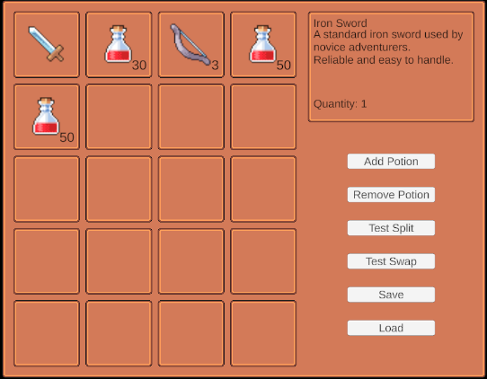
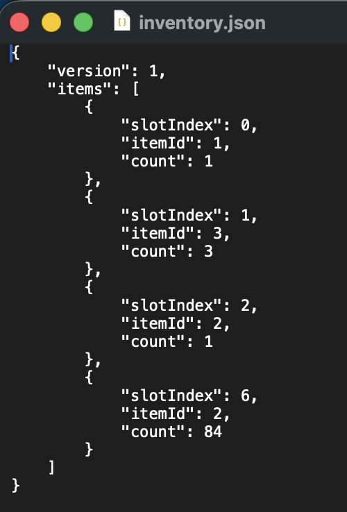

# InventoryLab

Unity UGUI 기반 인벤토리 시스템 학습 프로젝트

단순한 인벤토리 구현을 넘어 데이터 중심 설계, 이벤트 기반 UI 갱신, 드래그 앤 드롭, JSON 저장/불러오기 등 실제 게임 서비스에서 사용되는 구조를 학습하고 구현하는 것을 목표로 제작하였습니다.

---

## 스크린샷

### UI 화면


### 저장 데이터 예시


---

## 개발 환경

- Unity 6
- C#
- UGUI
- TextMeshPro

---

## 프로젝트 목표

- UGUI 레이아웃 시스템 이해
- ScriptableObject 기반 데이터 관리
- Model / View 분리 설계
- 이벤트 기반 UI 갱신
- Drag & Drop 구현
- JSON 직렬화 및 저장 시스템 구현
- 사용자 입력 검증(Validation)
- UX를 고려한 팝업 인터페이스 구현

---

## 주요 기능

### 인벤토리 UI

- Grid Layout Group 기반 슬롯 자동 배치
- 아이템 아이콘 표시
- 수량 표시
- 상세 정보 패널

### 아이템 시스템

- ScriptableObject 기반 ItemData 관리
- 아이템 ID 기반 데이터 참조
- 스택 가능 여부 설정
- 최대 스택 수 설정

### 인벤토리 기능

- 아이템 추가
- 아이템 제거
- 스택 처리
- 빈 슬롯 탐색
- 슬롯 선택

### 드래그 앤 드롭

- 슬롯 간 아이템 이동
- 슬롯 간 아이템 교환
- EventSystem 기반 Drag & Drop 구현

### 저장 / 불러오기

- JSON 직렬화
- Application.persistentDataPath 저장
- Inventory Export / Import 지원

### Split Item

- 선택한 아이템의 수량 분할
- 실시간 입력값 검증
- 최대 분할 가능 수량 표시
- 유효한 입력 시에만 Confirm 버튼 활성화

---

## 프로젝트 구조

```text
Assets
└── Scripts
├── Data
│ └── ItemData.cs
│
├── Inventory
│ ├── InventoryItem.cs
│ ├── InventoryModel.cs
│ └── ItemDatabase.cs
│
├── UI
│ ├── InventoryUI.cs
│ ├── InventorySlotUI.cs
│ ├── InventoryDetailUI.cs
│ └── InventoryDragContext.cs
│
└── Save
├── InventorySaveData.cs
├── InventorySlotSaveData.cs
└── InventorySaveSystem.cs
```
---

## 핵심 설계

### ScriptableObject 기반 아이템 데이터

아이템 정의 데이터는 ScriptableObject로 관리하고, 실제 인벤토리 데이터는 별도로 저장한다.

ItemData
↓
InventoryItem
↓
InventoryModel

이를 통해 데이터 정의와 런타임 데이터를 분리하였다.

---

### 이벤트 기반 UI 갱신

InventoryModel은 직접 UI를 참조하지 않는다.

```text
InventoryModel
↓ Event
InventoryUI
↓
InventorySlotUI
```

데이터 변경 시 이벤트를 발생시키고 UI는 해당 이벤트를 구독하여 갱신하도록 설계하였다.

---

### Drag & Drop 구조

```text
InventorySlotUI
↓
InventoryUI
↓
InventoryModel
```

UI는 입력만 처리하며 실제 데이터 변경은 InventoryModel에서 수행한다.

이를 통해 UI와 데이터 계층의 책임을 분리하였다.

---

### 저장 시스템

인벤토리 데이터는 JSON으로 직렬화하여 저장한다.

예시:
```text
{
  "version": 1,
  "items": [
    {
      "slotIndex": 0,
      "itemId": 1,
      "count": 1
    },
    {
      "slotIndex": 1,
      "itemId": 2,
      "count": 50
    }
  ]
}
```

---

### Split Popup UX

```text
Split Button
      ↓
Popup Open
      ↓
Input Validation
      ↓
Confirm Button Enable
      ↓
InventoryModel.SplitItem()
```

Split 기능은 Popup UI와 InventoryModel을 분리하여 구현하였다.

Popup은 입력과 검증만 담당하며, 실제 데이터 변경은 InventoryModel에서 수행하도록 설계하였다.

---

## 학습 내용

이번 프로젝트를 통해 다음 내용을 학습하였다.

- RectTransform
- Anchor / Pivot
- Grid Layout Group
- ScriptableObject
- Event 기반 아키텍처
- Drag & Drop
- JSON Serialization
- Save / Load 시스템
- Model / View 분리 설계
- 사용자 입력 Validation
- UI 상태 관리(Button Interactable)
- Popup UI 설계

---

## 향후 개선 예정

- 아이템 스택 병합
- 아이템 분할(Split)
- 장비 슬롯 시스템
- Addressables 아이콘 로드
- 버전 관리(Migration)
- Unit Test 추가

---